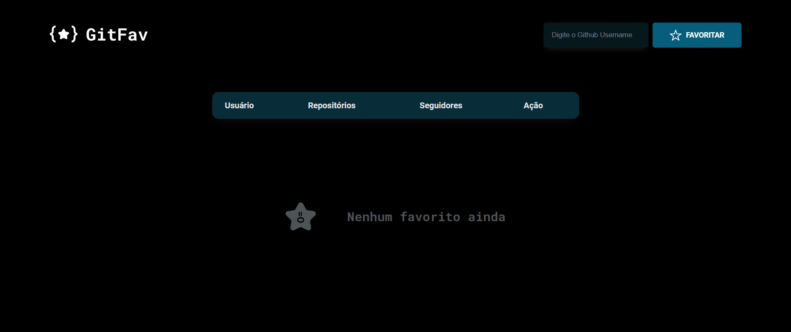
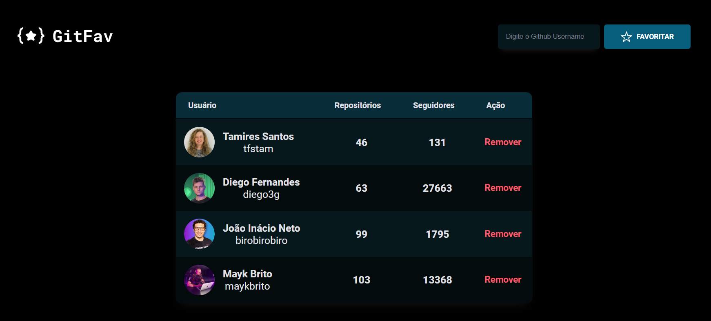

<h1 align="center">GitFav</h1>

  <a href="#-tecnologias">Tecnologias</a>&nbsp;&nbsp;&nbsp;|&nbsp;&nbsp;&nbsp;
  <a href="#-projeto">Projeto</a>&nbsp;&nbsp;&nbsp&nbsp;&nbsp;&nbsp;

 

Você pode visualizar projeto completo através [DESSE LINK](https://sarahvjustino.github.io/GitFav-Explorer/)

## 🚀 Tecnologias

Esse projeto foi desenvolvido com as seguintes tecnologias:

- HTML e CSS
- JavaScript
- Git e Github

## 💻 Projeto

Projeto em que é possível adicionar o perfil dos seus usúarios favoritos do github.
